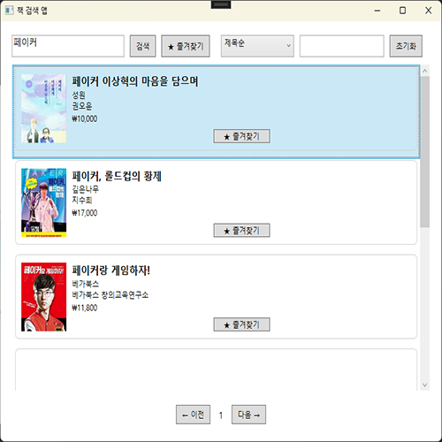
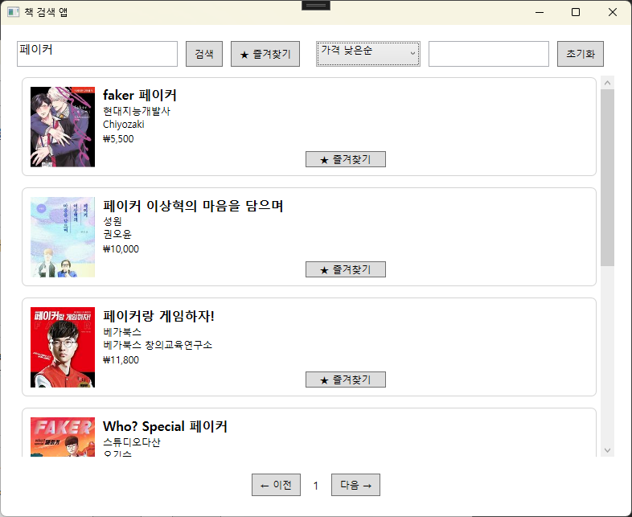
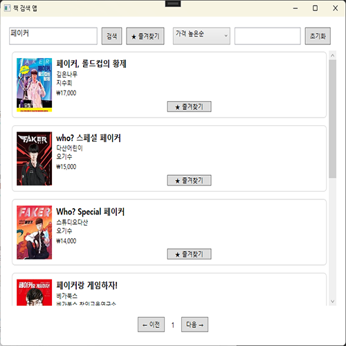
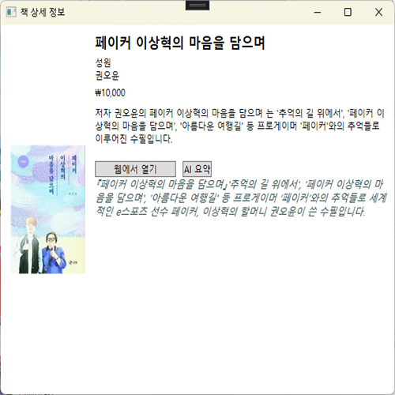
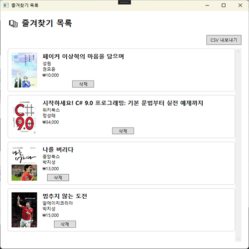

# 📚 BookSearchApp

Kakao Book API를 활용해 책을 검색하고 즐겨찾기, 정렬, 필터링, AI 요약 기능까지 지원하는 WPF MVVM 책 검색 애플리케이션입니다.

---

## 🔧 기술 스택

* WPF (.NET 8)
* MVVM 아키텍처 (CommunityToolkit.Mvvm)
* Kakao Book API
* OpenAI GPT API (AI 요약)
* 로컬 JSON 파일 저장 (즐겨찾기 저장용)
  
---

##  주요 기능

| 기능         | 설명                                                   |
| ---------- | ---------------------------------------------------- |
|  검색 기능   | 키워드로 Kakao Book API에서 책 검색                           |
|  즐겨찾기    | 책을 즐겨찾기에 추가/삭제하고 CSV로 내보내기                           |
|  정렬/필터   | 제목순, 가격 낮은순/높은순 정렬 + 출판사 필터 적용                       |
|  책 상세 정보 | 책의 제목, 저자, 출판사, 설명, 가격 등 정보 확인                       |
|  AI 요약   | OpenAI API를 사용해 책 내용을 요약해주는 기능 (현재는 응답 제한으로 하드코딩 처리) |

---

## 📁 폴더 구조

```
BookSearchApp/
├── Models/              # Book 모델 및 즐겨찾기 저장 로직
├── Services/            # Kakao API, OpenAI API 호출 서비스
├── ViewModels/         # MainViewModel, BookDetailViewModel 등
├── Views/              # MainView.xaml, BookDetailView.xaml 등 UI
├── Screenshots/        # README에 사용되는 UI 캡처 이미지 모음
└── App.xaml            # 전역 리소스 (예: BoolToVisibilityConverter)
```

---

## 🖼️ 스크린샷

### 🔍 검색 기능



### 🔤 정렬 기능 (가격 낮은순)



### 🔤 정렬 기능 (가격 높은순)



### 📄 책 상세 정보 + AI 요약



### 🌟 즐겨찾기 목록



---

## 📦 즐겨찾기 CSV 예시

```
```

---

## 🚧 주의사항

* OpenAI API는 무료 크레딧 소진 시 `429 Too Many Requests` 오류가 발생할 수 있습니다.

---

