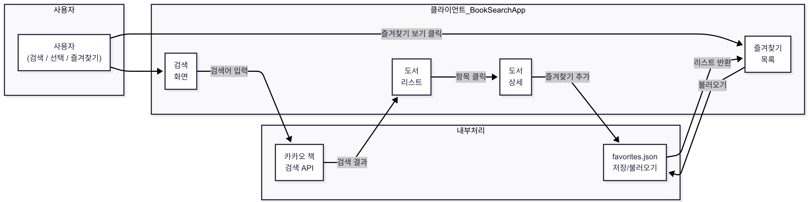

# 책 검색 앱

## 프로젝트 개요

- WPF .NET8 MVVM 데스크탑 앱으로, Kakao Book API 기반 도서 검색 기능과 OpenAI API 기반 책 요약 기능을 지원
- 즐겨찾기 기능은 로컬 JSON에 저장되며, 정렬 및 필터링 등 UI 기능 제공
- **클라이언트**: WPF(.NET 8, MVVM), Kakao Book API 및 OpenAI GPT 연동, 즐겨찾기 로컬 저장
- **서버 연동 없음**: 외부 API만 사용 (Kakao, OpenAI)

---

## 아키텍처



### 전체 구조

```plaintext
BookSearchApp/
├─ Models/         # Book, Author 등 도서 모델 + 즐겨찾기 저장/로드 로직
├─ Services/       # Kakao Book API, OpenAI GPT API 호출 로직
├─ ViewModels/     # MVVM 구조 ViewModel (Main, Detail 등)
├─ Views/          # XAML 화면 정의 (Main, Detail, Favorites 등)
├─ Resources/      # 이미지 및 스타일
├─ Converters/     # 정렬/필터용 바인딩 컨버터
├─ App.xaml(.cs)   # 앱 실행 진입점 및 전역 리소스 등록
└─ favorites.json  # 즐겨찾기 저장 JSON 파일 (자동 생성)
```
 
---

## 요구사항 및 NuGet 라이브러리

### BookSearchApp 클라이언트
- **운영체제:** Windows 10/11
- **.NET:** .NET 8 이상
- **IDE:** Visual Studio 2022 이상
- **NuGet 패키지:**
  - `CommunityToolkit.Mvvm` (MVVM 아키텍처 지원)

---

## 주요 기능

### 사용자
- **도서 검색**: Kakao Book API를 통해 도서 제목 기반 실시간 검색
- **책 상세 보기**: 표지, 제목, 저자, 출판사, 설명, 가격 등 정보 표시
- **즐겨찾기**: 즐겨찾기 추가/삭제, JSON 저장/불러오기, CSV로 내보내기 지원
- **정렬/필터**: 제목순, 가격순(낮은/높은), 출판사 필터 등 다양한 정렬/필터 기능
- **AI 요약**: OpenAI GPT API를 사용하여 책 설명 요약 제공

---

## 기술 스택

- **C#, .NET 8**
- **WPF (MVVM 패턴)**
- **CommunityToolkit.Mvvm (MVVM 지원 라이브러리)**
- **Kakao Book API (도서 검색 API)**
- **OpenAI GPT API (책 내용 요약)**
- **System.Text.Json (즐겨찾기 직렬화/역직렬화)**
- **ObservableCollection / INotifyPropertyChanged (UI 실시간 반영)**

---

## 스크린샷

| 검색 결과 | 정렬 기능 (가격 높은순) |
|-------------|-----------------------------|
|  |  |

| 상세 정보 & AI 요약 | 즐겨찾기 목록 |
|------------------------|------------------|
|  |  |

---

## 주의사항

- **OpenAI API**는 유료 크레딧이 소진되면 `429 Too Many Requests` 오류가 발생할 수 있습니다.
- **Kakao Book API**는 일일 호출 횟수 제한이 있으므로 주의가 필요합니다.

